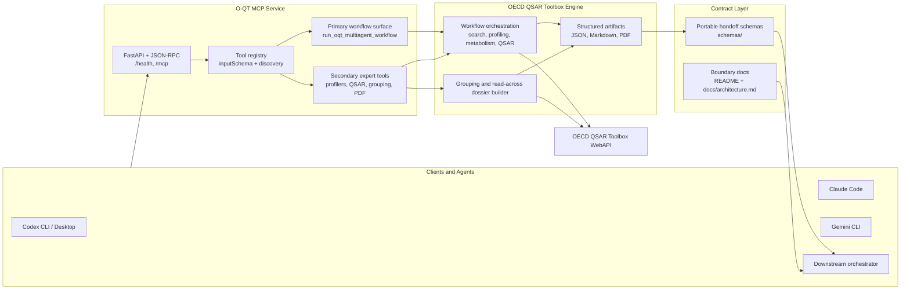

# O-QT MCP Server [](https://github.com/ToxMCP/oqt-mcp/actions/workflows/ci.yml) [](https://doi.org/10.64898/2026.02.06.703989) [](./LICENSE) [](https://github.com/ToxMCP/oqt-mcp/releases) [](https://www.python.org/)

> Part of **ToxMCP** Suite -> https://github.com/ToxMCP/toxmcp
>
> O-QT MCP is the ToxMCP suite's specialized OECD QSAR Toolbox workflow engine.
> It is designed to be consumed by downstream orchestrators or any other MCP-compatible client.

**Public MCP endpoint for the OECD QSAR Toolbox.**  
Run QSAR workflows, grouping/read-across dossiers, and audit-ready PDF reports through any MCP-aware agent (Claude Code, Codex CLI, Gemini CLI, etc.).

## Architecture



The current implementation follows a layered model:

- `run_oqt_multiagent_workflow` is the primary workflow entrypoint for downstream automation.
- Lower-level Toolbox tools remain public for expert use, debugging, and custom orchestration.
- Portable handoff schemas live under `schemas/` and carry O-QT-owned evidence forward without turning O-QT into the suite orchestrator.
- Final suite-level evidence synthesis, BER/WoE logic, and cross-module decisions belong above O-QT in a downstream orchestrator.

See [docs/architecture.md](docs/architecture.md) for the fuller boundary and contract notes.
See [docs/oecd_alignment_review_2025.md](docs/oecd_alignment_review_2025.md) for the OECD 2025 grouping/IUCLID gap analysis and the next contract-focused improvements.
See [docs/cross_suite_alignment_2026.md](docs/cross_suite_alignment_2026.md) for the public contract patterns adopted into O-QT.

## What's New In v0.3.1

This release focuses on audit remediation and scientific governance controls.

- **Human review checkpoints** — `run_oqt_multiagent_workflow` now supports `require_human_review=true` to pause at `chemical_identity`, `ad_assessment`, and `final_report` checkpoints before generating artifacts.
- **AD hard gating** — Out-of-domain QSAR predictions block PDF generation when review mode is enabled.
- **Privacy-aware logging** — SMILES, CAS numbers, chemical names, and API keys are automatically hashed in audit logs and `httpx` URL traces.
- **LLM prompt sanitization** — Untrusted identifiers are scrubbed of control characters and formatting symbols before entering LLM-facing contexts.
- **PDF provenance** — Fallback PDF reports now include a disclaimer header, applicability-domain warnings, and a provenance summary.
- **Safer search defaults** — `search_type` now defaults to `"name"` instead of `"auto"`.

## What's New In v0.3.0

This is a contract-hardening and validation release, not a redesign.

- Bumped the public package and runtime version to `0.3.0`.
- Hardened `oqtHazardEvidenceSummary.v1` and `oqtReadAcrossSummary.v1` with machine-readable `assessmentBoundary`, `decisionBoundary`, `decisionOwner`, `supports`, and `requiredExternalInputs`.
- Added `semanticCoverage` to the hazard uncertainty contract so the MCP states explicitly that O-QT uncertainty is qualitative evidence packaging, not probabilistic confidence.
- Expanded normalized provenance and study packaging so hazard outputs can carry endpoint study records, endpoint summaries, evidence blocks, and source-call metadata in a more audit-ready shape.
- Added configurable wall-clock safeguards and a live smoke suite for the Toolbox-backed surface, including hazard analysis, workflow handoffs, grouping dossiers, and log replay.
- Refreshed the public docs so the README, schemas, and release notes reflect the current contract surface without referencing still-private modules.

## Published Schemas

Portable O-QT handoff objects are now published as machine-readable JSON Schemas under `schemas/`, with matching examples under `schemas/examples/`.

Published object family:

- `schemas/oqtHazardEvidenceSummary.v1.json`
- `schemas/oqtReadAcrossSummary.v1.json`
- `schemas/oqtWorkflowRecord.v1.json`

Design intent:

- These are handoff objects, not final decision objects.
- O-QT owns Toolbox-native workflow evidence, grouping/read-across packaging, and provenance.
- Final suite-level evidence synthesis belongs in a downstream orchestrator, not inside O-QT MCP.
- Example instances live under `schemas/examples/` and are validated in tests.

## Why this project exists

Chemical safety work often relies on the proprietary OECD QSAR Toolbox desktop application. Scientists have to click through many screens to gather profilers, metabolism simulators, and QSAR predictions before writing regulatory reports.

The O-QT MCP server turns that workflow into an **open, programmable interface**:

- **Primary workflow entrypoint**: `run_oqt_multiagent_workflow` orchestrates the same multi-agent pipeline used in the O-QT AI Assistant.
- **Structured JSON + Markdown + PDF** responses are returned in one call, ready for downstream automation.
- **Expert helper surface**: lower-level Toolbox tools remain available for debugging, specialist review, and custom orchestration.
- **Vendor-neutral**: any coding agent that speaks MCP can trigger analyses and capture outputs.

> Looking for the original assistant UI? See [O-QT-OECD-QSAR-Toolbox-AI-assistant](https://github.com/VHP4Safety/O-QT-OECD-QSAR-Toolbox-AI-assistant). The MCP server reuses the same core logic but wraps it in a secure, headless API designed for automation.
>
> Related publication: [Artificial intelligence for integrated chemical safety assessment using OECD QSAR Toolbox](https://doi.org/10.1016/j.comtox.2025.100395).
>
> bioRxiv preprint: [10.64898/2026.02.06.703989v1 (Ivo Djidrovski et al.)](https://www.biorxiv.org/content/10.64898/2026.02.06.703989v1).

---

## Feature snapshot

| Capability | Description |
| --- | --- |
| 🔬 **Primary workflow engine** | Calls the OECD QSAR Toolbox WebAPI to run searches, profilers, metabolism simulators, curated QSAR models, and the flagship `run_oqt_multiagent_workflow` entrypoint. |
| 🧩 **Grouping/read-across support** | Builds OECD-style grouping dossiers through `build_grouping_justification` with structured similarity and uncertainty reporting. |
| 📦 **Portable handoff contracts** | Publishes stable cross-suite handoff schemas for downstream orchestrators and other contract consumers, including evidence blocks, applicability-domain review, and attachment manifests. |
| 🧾 **Regulatory-ready reporting** | Generates a comprehensive PDF (ReportLab), Markdown narrative, and JSON provenance bundle. |
| 🛡️ **Enterprise security** | OAuth2/OIDC token validation, RBAC per tool, audit logging, and Docker hardening. |
| 🤖 **Agent friendly** | Tested with Claude Code, Codex CLI, and Gemini CLI (see [integration guide](docs/integration_guides/mcp_integration.md)). |

---

## Table of contents

1. [Architecture](#architecture)
2. [What's New In v0.3.1](#whats-new-in-v031)
3. [What's New In v0.3.0](#whats-new-in-v030)
4. [Published Schemas](#published-schemas)
5. [Quick start](#quick-start)
6. [Related resources](#related-resources)
7. [Configuration](#configuration)
8. [Public surface model](#public-surface-model)
9. [Tool catalog](#tool-catalog)
10. [Running the server](#running-the-server)
11. [Deployment modes](#deployment-modes)
12. [Integrating with coding agents](#integrating-with-coding-agents)
13. [Downstream orchestration](#downstream-orchestration)
14. [Output artifacts](#output-artifacts)
15. [Human review checkpoints](#human-review-checkpoints)
16. [Security checklist](#security-checklist)
17. [Current limitations](#current-limitations)
18. [Development notes](#development-notes)
19. [Roadmap](#roadmap)
20. [License](#license)

---

## Quickstart TL;DR

```bash
poetry install
cp .env.example .env
# set QSAR_TOOLBOX_API_URL in .env
poetry run uvicorn src.api.server:app --reload --host 0.0.0.0 --port 8000
curl -s http://localhost:8000/health | jq .
```

## Quick start

```bash
git clone https://github.com/ToxMCP/oqt-mcp.git
cd oqt-mcp
poetry install
cp .env.example .env
poetry run uvicorn src.api.server:app --reload
```

> **Important:** The server needs access to a running OECD QSAR Toolbox WebAPI instance (typically on a Windows host). Set `QSAR_TOOLBOX_API_URL` in `.env` to point to it.

Once running, your MCP host connects to `http://localhost:8000/mcp`.

---

## Related resources

- **ToxMCP suite overview:** [ToxMCP/toxmcp](https://github.com/ToxMCP/toxmcp)
- **Original interactive UI (Streamlit app):** [VHP4Safety/O-QT-OECD-QSAR-Toolbox-AI-assistant](https://github.com/VHP4Safety/O-QT-OECD-QSAR-Toolbox-AI-assistant)
- **Peer-reviewed publication:** [Artificial intelligence for integrated chemical safety assessment using OECD QSAR Toolbox](https://doi.org/10.1016/j.comtox.2025.100395)
- **bioRxiv preprint (Ivo Djidrovski et al.):** [10.64898/2026.02.06.703989v1](https://www.biorxiv.org/content/10.64898/2026.02.06.703989v1)

---

## Configuration

| Variable | Required | Default | Description |
| --- | --- | --- | --- |
| `QSAR_TOOLBOX_API_URL` | ✅ | `http://localhost:5000` | Base URL to the OECD QSAR Toolbox WebAPI. |
| `QSAR_LIGHT_TIMEOUT_SECONDS` | Optional | `30` | Per-request timeout for lightweight Toolbox calls. |
| `QSAR_HEAVY_TIMEOUT_SECONDS` | Optional | `300` | Per-request timeout for expensive Toolbox calls such as reports, workflows, and some simulations. |
| `QSAR_LIGHT_MAX_ATTEMPTS` | Optional | `2` | Retry count for lightweight Toolbox calls. |
| `QSAR_HEAVY_MAX_ATTEMPTS` | Optional | `3` | Retry count for expensive Toolbox calls. |
| `QSAR_HEAVY_CONCURRENCY` | Optional | `3` | Concurrency cap for heavy Toolbox calls issued by the MCP. |
| `QSAR_HAZARD_PROFILING_WALLCLOCK_TIMEOUT_SECONDS` | Optional | `25` | Wall-clock cap for the profiling sweep inside `analyze_chemical_hazard`; returns explicit partial evidence if exceeded. |
| `QSAR_DISCOVERY_LIST_ALL_TOTAL_WALLCLOCK_TIMEOUT_SECONDS` | Optional | `45` | Total wall-clock budget for `list_all_qsar_models`. |
| `QSAR_DISCOVERY_LIST_ALL_PER_POSITION_TIMEOUT_SECONDS` | Optional | `6` | Per-endpoint-tree-position timeout while enumerating the QSAR model catalog. |
| `QSAR_DISCOVERY_SEARCH_DATABASES_WALLCLOCK_TIMEOUT_SECONDS` | Optional | `20` | Wall-clock cap for `list_search_databases`; fails fast on timeout. |
| `AUTH_OIDC_ISSUER` | ✅ (prod) | – | OIDC issuer URL (Auth0, Keycloak, etc.). |
| `AUTH_OIDC_AUDIENCE` | ✅ (prod) | – | Expected audience in access tokens. |
| `AUTH_OIDC_ALGORITHMS` | ✅ (prod) | `["RS256"]` | Allowed JWT algorithms. |
| `AUTH_ROLE_CLAIM_PATH` | Optional | `roles` | Dot path to extract role claims from the JWT. |
| `BYPASS_AUTH` | Dev only | `false` | When `true`, skips auth and injects a `SYSTEM_BYPASS` role. |
| `AUTH_JWKS_CACHE_TTL_SECONDS` | Optional | `300` | TTL for JWKS cache. |
| `LOG_LEVEL` | Optional | `INFO` | Log verbosity. |
| `ENVIRONMENT` | Optional | `development` | Included in logs and `/health` response. |
| `ASSISTANT_PROVIDER` | Optional | – | Set to `OpenAI` or `OpenRouter` to enable the legacy O-QT multi-agent workflow. |
| `ASSISTANT_MODEL` | Optional | `gpt-4.1-nano` | LLM identifier to use when the assistant path is enabled. |
| `ASSISTANT_API_KEY` | Optional | – | API key for the selected provider. Falls back to `OPENAI_API_KEY` / `OPENROUTER_API_KEY` if absent. |

Compatibility note: the current client targets Toolbox WebAPI `/api/v6` routes. Newer Toolbox builds are supported as long as they keep the v6 compatibility layer enabled.

Operational note: on slower Toolbox hosts, prefer tuning the wall-clock safeguards above rather than only increasing retry counts. The MCP is designed to return explicit partial evidence or timeout errors, not to block indefinitely on discovery-heavy endpoints.

See [docs/auth_testing.md](docs/auth_testing.md) for token generation tips and bypass mode safety.

---

## Public surface model

- **Primary mode:** `run_oqt_multiagent_workflow` is the recommended default entrypoint for downstream automation.
- **Secondary helper tools:** lower-level Toolbox tools remain public for expert use, debugging, and custom orchestration.
- **Grouping/read-across:** `build_grouping_justification` packages O-QT-native dossier evidence without claiming suite-level final decisions.
- **Suite boundary:** final evidence synthesis and decision logic belong to a downstream orchestrator, not to O-QT MCP itself.

---

## Tool catalog

| Tool | Description |
| --- | --- |
| `run_oqt_multiagent_workflow` | Executes the full O-QT multi-agent pipeline (search + profiling + optional QSAR) and returns structured JSON results, Markdown narrative, and a PDF report. |
| `build_grouping_justification` | Builds an OECD-style grouping/read-across dossier with structured context, similarity assessment, uncertainty reporting, and PDF output. |
| `list_profilers` | Lists profilers configured inside the OECD QSAR Toolbox. |
| `get_profiler_info` | Provides metadata, categories, and literature links for a specific profiler. |
| `list_simulators` | Lists metabolism simulators (e.g., liver, skin, microbial). |
| `get_simulator_info` | Provides detailed information for a simulator GUID. |
| `list_calculators` | Lists calculator modules for physicochemical property estimation. |
| `get_calculator_info` | Returns description, units, and notes for a calculator. |
| `get_endpoint_tree` | Returns the endpoint taxonomy used to organise profilers and models. |
| `get_metadata_hierarchy` | Returns the metadata hierarchy useful for filtering experimental data. |
| `list_qsar_models` | Lists QSAR models for a specific endpoint tree position. |
| `list_all_qsar_models` | Enumerates the full QSAR catalog across the endpoint tree (deduplicated). Returns partial catalog metadata and warnings if enumeration exceeds the configured wall-clock budget. |
| `list_search_databases` | Enumerates searchable inventories in the QSAR Toolbox. Fails fast on timeout rather than waiting through the full heavy retry budget. |
| `run_qsar_model` | Runs a specific QSAR model for a chemId and reports applicability domain status. |
| `run_profiler` | Executes a profiler for a chemId (optionally providing a simulator). |
| `run_metabolism_simulator` | Runs a metabolism simulator using either a chemId or SMILES. |
| `download_qmrf` | Retrieves the QMRF report for a QSAR model. |
| `download_qsar_report` | Retrieves the QSAR prediction report produced by the Toolbox. |
| `execute_workflow` | Runs a Toolbox workflow for a chemId. |
| `download_workflow_report` | Retrieves a workflow execution report. |
| `group_chemicals_by_profiler` | Builds read-across groups for a chemId using a profiler GUID. |
| `canonicalize_structure` | Returns the canonical SMILES for a structure. |
| `structure_connectivity` | Returns the connectivity string for the supplied SMILES. |
| `render_pdf_from_log` | Generates the regulatory PDF from a stored comprehensive log (no rerun). |
| `build_portable_handoffs_from_log` | Reconstructs schema-aligned `portable_handoffs` from a stored O-QT log bundle (no rerun). |

### `run_oqt_multiagent_workflow` parameters

| Parameter | Type | Required | Description |
| --- | --- | --- | --- |
| `identifier` | string | ✅ | Chemical identifier (name, CAS, or SMILES). |
| `search_type` | enum(`name`, `cas`, `smiles`) | ✅ | How to interpret `identifier`. |
| `context` | string | – | Free-form text describing the analysis context. |
| `profiler_guids` | array[string] | – | Explicit profilers to run. |
| `qsar_mode` | enum(`recommended`,`all`,`none`) | – | QSAR preset (defaults to curated `recommended`). |
| `qsar_guids` | array[string] | – | Exact QSAR model GUIDs. |
| `simulator_guids` | array[string] | – | Metabolism simulators to execute. |
| `llm_provider` | string | – | Override LLM provider (e.g., `openai`, `openrouter`). |
| `llm_model` | string | – | LLM model identifier. |
| `llm_api_key` | string | – | API key when not provided via environment. |
| `require_human_review` | boolean | – | When `true`, high-risk checkpoints require explicit approval before artifacts are generated. |
| `workflow_id` | string | – | Optional workflow ID for resuming a review-paused workflow. |
| `checkpoint_approvals` | array[{checkpoint_id, decision, comments}] | – | Pre-approved checkpoints to resume a paused workflow. |

### `build_grouping_justification` parameters

| Parameter | Type | Required | Description |
| --- | --- | --- | --- |
| `identifier` | string | ✅ | Target chemical identifier (name, CAS, or SMILES). |
| `search_type` | enum(`auto`,`name`,`cas`,`smiles`) | – | How to interpret the target identifier. |
| `problem_formulation` | string | ✅ | Intended use of the grouping or read-across exercise. |
| `decision_context` | string | ✅ | Context such as screening, hazard identification, or risk assessment. |
| `endpoints` | array[string] | ✅ | Endpoint list to justify in the dossier. |
| `route_of_exposure` | string | – | Optional route of exposure relevant to the endpoints. |
| `grouping_hypothesis` | string | ✅ | Why the target and source chemicals are expected to be sufficiently similar. |
| `analogue_identifiers` | array[string] | – | Candidate source analogues or category members to resolve in the Toolbox. |
| `analogue_search_type` | enum(`auto`,`name`,`cas`,`smiles`) | – | How to interpret the analogue identifiers. |
| `profiler_guids` | array[string] | – | Profilers used to support the similarity rationale. |
| `simulator_guids` | array[string] | – | Metabolism simulators used to support ADME/TK similarity. |
| `qsar_guids` | array[string] | – | QSAR models used as supporting evidence for the target substance. |
| `accepted_uncertainty_level` | enum(`low`,`medium`,`high`) | – | Maximum residual uncertainty tolerated for the stated purpose. |
| `context` | string | – | Optional extra narrative instructions for the dossier. |

### Response payload

```jsonc
{
  "status": "ok",
  "identifier": "Acetone",
  "summary_markdown": "...",
  "log_json": { "...": "..." },
  "pdf_report_base64": "JVBERi0xLjcKJ...",
  "portable_handoffs": {
    "oqtWorkflowRecord.v1": { "...": "..." },
    "oqtHazardEvidenceSummary.v1": { "...": "..." }
  }
}
```

- `summary_markdown` – same narrative presented in the assistant UI.
- `log_json` – comprehensive bundle. When the assistant workflow runs, the payload includes:  
  - `assistant_session` (provider/model, duration, specialist outputs)  
  - `mcp_workflow` (deterministic fallback summary and Toolbox metadata)  
  - `analysis`, `data_retrieval`, and other sections reused by the original app.
- `build_grouping_justification` adds a `grouping_justification` object with target/analogue resolution, similarity assessment, endpoint conclusions, and uncertainty reporting.
- `pdf_report_base64` – base64-encoded, publication-ready PDF.
- `portable_handoffs` – schema-aligned handoff objects for downstream orchestration. `build_grouping_justification` returns `oqtWorkflowRecord.v1` plus `oqtReadAcrossSummary.v1`; `run_oqt_multiagent_workflow` returns `oqtWorkflowRecord.v1` plus `oqtHazardEvidenceSummary.v1`.
- `oqtWorkflowRecord.v1` now declares `rootEntity`, `packageSemantics`, and an auditable `attachments` manifest with checksums when the inline payload is available.
- `oqtHazardEvidenceSummary.v1` now carries request metadata, explicit assessment and decision boundaries, support claims, required external inputs, endpoint summaries, source attribution for model/profiler/simulator evidence, and a qualitative uncertainty block with `semanticCoverage` that explicitly states it is an evidence-completeness assessment rather than a probabilistic estimate.
- `oqtReadAcrossSummary.v1` now promotes explicit assessment and decision boundaries, required external inputs, applicability-domain notes, the portable evidence matrix, and the aspect-level uncertainty table into the published handoff contract.
- Portable downstream contracts are published separately under `schemas/`; see [schemas/README.md](schemas/README.md).

### Metadata & provenance fields

The MCP exposes normalized provenance wherever the Toolbox already returns ownership or study metadata:

- `get_public_qsar_model_info`, `get_profiler_info`, `get_simulator_info`, and `get_calculator_info` include a top-level `provenance` block.
- `list_qsar_models` and `list_all_qsar_models` attach a compact `provenance_summary` to each catalog record.
- `run_qsar_prediction`, `run_qsar_model`, `download_qmrf`, and `download_qsar_report` include `model_provenance`.
- `run_profiler` and `group_chemicals_by_profiler` include `profiler_provenance`.
- `generate_metabolites` and `run_metabolism_simulator` include `simulator_provenance`.
- `analyze_chemical_hazard` now normalizes endpoint study records, endpoint summaries, evidence blocks, applicability-domain review, provenance collections, and a portable `oqtHazardEvidenceSummary.v1` handoff alongside the raw Toolbox payloads. The helper is intentionally bounded: if `profiling/all` is too slow, it returns partial endpoint evidence with explicit uncertainty and warning fields instead of waiting indefinitely.
- Hazard and read-across handoffs now publish machine-readable boundary fields (`assessmentBoundary`, `decisionBoundary`, `decisionOwner`) plus `supports` and `requiredExternalInputs`, so downstream systems can distinguish what O-QT packaged from what still requires expert review, regulatory policy, exposure context, or cross-module synthesis.
- High-level workflow outputs preserve the same normalized metadata inside `log_json.profiler_results[*].profiler_provenance`, `log_json.simulator_results[*].simulator_provenance`, and `log_json.qsar_results[*].model_provenance`.
- Report-style tools (`download_qmrf`, `download_qsar_report`, `download_workflow_report`) now also declare `content_type`; when the Toolbox returns a ZIP bundle rather than a bare PDF, the MCP response includes `archive_entries` and `pdf_report_base64` when a PDF member can be extracted.
- High-level workflows and grouping dossiers accept direct Toolbox `chemId` values as `identifier` inputs, which lets orchestrators bypass flaky search endpoints once a substance has already been resolved.

---

## Running the server

### Local development (Poetry)

```bash
poetry install
poetry run uvicorn src.api.server:app --host 0.0.0.0 --port 8000 --reload
```

### Quick MCP smoke test

Once the server is running on `http://localhost:8000/mcp` (and your `.env` points to a reachable Toolbox WebAPI), the following curl invocations exercise the main tools with Benzene as an example:

```bash
# 1. Handshake and tool discovery
curl -s http://localhost:8000/mcp \
  -H 'Content-Type: application/json' \
  -d '{"jsonrpc":"2.0","id":1,"method":"initialize","params":{"capabilities":{}}}'

curl -s http://localhost:8000/mcp \
  -H 'Content-Type: application/json' \
  -d '{"jsonrpc":"2.0","id":2,"method":"mcp/tool/list","params":{}}' | jq '.result.tools | length'

# 2. Resolve Benzene and pull discovery metadata
BENZENE_CHEMID=$(
  curl -s http://localhost:8000/mcp \
    -H 'Content-Type: application/json' \
    -d '{"jsonrpc":"2.0","id":3,"method":"mcp/tool/call","params":{"name":"search_chemicals","parameters":{"query":"Benzene","search_type":"name"}}}' \
  | jq -r '.result.content[0].text | fromjson | .items[0].ChemId'
)

echo "$BENZENE_CHEMID"

curl -s http://localhost:8000/mcp \
  -H 'Content-Type: application/json' \
  -d '{"jsonrpc":"2.0","id":4,"method":"mcp/tool/call","params":{"name":"list_profilers","parameters":{}}}' \
  | jq -r '.result.content[0].text | fromjson | .profilers[:5]'

# 3. Execute profilers / QSAR workflow (uses chemId from the first search hit)
PROFILER_GUID="a06271f5-944e-4892-b0ad-fa5f7217ec14"

curl -s http://localhost:8000/mcp \
  -H 'Content-Type: application/json' \
  -d "{\"jsonrpc\":\"2.0\",\"id\":5,\"method\":\"mcp/tool/call\",\"params\":{\"name\":\"run_profiler\",\"parameters\":{\"profiler_guid\":\"$PROFILER_GUID\",\"chem_id\":\"$BENZENE_CHEMID\"}}}" \
  | jq -r '.result.content[0].text | fromjson | .result'

curl -s http://localhost:8000/mcp \
  -H 'Content-Type: application/json' \
  -d "{\"jsonrpc\":\"2.0\",\"id\":6,\"method\":\"mcp/tool/call\",\"params\":{\"name\":\"run_oqt_multiagent_workflow\",\"parameters\":{\"identifier\":\"Benzene\",\"search_type\":\"name\",\"profiler_guids\":[\"$PROFILER_GUID\"]}}}" \
  | jq -r '.result.content[0].text | fromjson | {status: .status, summary: .summary_markdown, pdf_bytes: (.pdf_report_base64 | length)}'

# 4. Optional helpers
curl -s http://localhost:8000/mcp \
  -H 'Content-Type: application/json' \
  -d '{"jsonrpc":"2.0","id":7,"method":"mcp/tool/call","params":{"name":"canonicalize_structure","parameters":{"smiles":"c1ccccc1"}}}' \
  | jq -r '.result.content[0].text | fromjson'

# 5. Build an OECD-style grouping/read-across dossier
curl -s http://localhost:8000/mcp \
  -H 'Content-Type: application/json' \
  -d "{\"jsonrpc\":\"2.0\",\"id\":8,\"method\":\"mcp/tool/call\",\"params\":{\"name\":\"build_grouping_justification\",\"parameters\":{\"identifier\":\"Benzene\",\"search_type\":\"name\",\"problem_formulation\":\"Assess whether close aromatic hydrocarbon analogues can support exploratory read-across for repeated-dose toxicity.\",\"decision_context\":\"hazard_identification\",\"endpoints\":[\"Repeated dose toxicity\"],\"route_of_exposure\":\"oral\",\"grouping_hypothesis\":\"Target and source analogues are simple aromatic hydrocarbons expected to share related structural, mechanistic, and metabolic features.\",\"analogue_identifiers\":[\"Toluene\",\"Ethylbenzene\"],\"analogue_search_type\":\"name\",\"profiler_guids\":[\"$PROFILER_GUID\"],\"accepted_uncertainty_level\":\"medium\"}}}" \
  | jq -r '.result.content[0].text | fromjson | {status: .status, uncertainty: .grouping_justification.uncertainty_assessment.overall_level, structure: .grouping_justification.structure_comparison.summary, physchem: .grouping_justification.physicochemical_comparison.summary}'

# 6. Rebuild portable handoffs from a stored log bundle (no Toolbox rerun)
WORKFLOW_RESPONSE=$(
  curl -s http://localhost:8000/mcp \
    -H 'Content-Type: application/json' \
    -d "{\"jsonrpc\":\"2.0\",\"id\":9,\"method\":\"mcp/tool/call\",\"params\":{\"name\":\"run_oqt_multiagent_workflow\",\"parameters\":{\"identifier\":\"Benzene\",\"search_type\":\"name\",\"profiler_guids\":[\"$PROFILER_GUID\"]}}}"
)

WORKFLOW_LOG=$(echo "$WORKFLOW_RESPONSE" | jq -c '.result.content[0].text | fromjson | .log_json')

curl -s http://localhost:8000/mcp \
  -H 'Content-Type: application/json' \
  -d "{\"jsonrpc\":\"2.0\",\"id\":10,\"method\":\"mcp/tool/call\",\"params\":{\"name\":\"build_portable_handoffs_from_log\",\"parameters\":{\"log\":$WORKFLOW_LOG}}}" \
  | jq -r '.result.content[0].text | fromjson | .portable_handoffs | keys'
```

You should see:

- Tool listing reporting around 31 tools (including compatibility aliases).
- `search_chemicals` resolving Benzene to a Toolbox `chemId`.
- Profiler execution returning the “Class 1 (narcosis or baseline toxicity)” call.
- `run_oqt_multiagent_workflow` producing a Markdown summary along with a non-empty Base64 PDF payload (written to disk automatically when invoked via Codex, Claude, or Gemini CLIs).
- `build_portable_handoffs_from_log` regenerating `oqtWorkflowRecord.v1` and the matching domain handoff object from a stored `log_json`.
- `GET /mcp` returning `405 Method Not Allowed` is expected; use JSON-RPC `POST` requests.

### Docker

```bash
docker build -t o-qt-mcp-server .
docker run -d --name o-qt-mcp \
  --env-file .env \
  -p 8000:8000 \
  o-qt-mcp-server
```

### Optional: Enable the legacy O-QT assistant workflow

The MCP can reuse the multi-agent prompts and PDF template from the original O-QT assistant. Configure the following before starting the server:

```bash
export ASSISTANT_PROVIDER=OpenAI               # or OpenRouter
export ASSISTANT_MODEL=gpt-4.1-nano            # any model supported by the provider
export ASSISTANT_API_KEY=sk-...                # falls back to OPENAI_API_KEY/OPENROUTER_API_KEY
```

With these variables set, `run_oqt_multiagent_workflow` will call the same specialist agents used by the Streamlit app, return the full assistant transcript inside `log_json.assistant_session`, and embed the assistant-generated PDF in `pdf_report_base64`. If the assistant cannot run (missing key, upstream error, etc.) the MCP automatically falls back to the deterministic summary.

### Docker Compose (with Toolbox stub)

```bash
docker compose up --build
```

This launches:

| Service | Purpose | Port |
| --- | --- | --- |
| `mcp-server` | The MCP server | 8000 |
| `toolbox-stub` | Mock Toolbox WebAPI for demos | 5000 |

Update `.env` to point at a real Toolbox instance before production use.

---

## Deployment modes

| Profile | Shape | Suitable for | Notes |
| --- | --- | --- | --- |
| `local-dev` | Single FastAPI process, optional auth bypass | Workstation development, smoke tests, prompt-driven debugging | Calls the Toolbox WebAPI synchronously. |
| `controlled-prod` | FastAPI behind TLS reverse proxy with OIDC, RBAC, and audit shipping | Internal deployments and orchestrated suite flows | Still synchronous in v0.3.0; scale with worker policy and operational guardrails rather than a built-in queue. |
| `not-in-v0.3.0` | Async queue and persistence layer | Detached batch jobs and large-scale job replay | Remains roadmap work. |

This release intentionally tightens the deployment story instead of over-claiming platform maturity.

---

## Integrating with coding agents

Follow [docs/integration_guides/mcp_integration.md](docs/integration_guides/mcp_integration.md) for step-by-step instructions covering:

- Claude Code / Cursor
- Codex CLI
- Gemini CLI
- Generic MCP hosts

Each guide includes JSON snippets for provider configuration and tips for handling OAuth tokens.

---

## Downstream orchestration

O-QT is a module-scoped engine inside the broader suite. A typical orchestrated flow is:

1. A downstream orchestrator calls `run_oqt_multiagent_workflow` for Toolbox-native hazard evidence or `build_grouping_justification` for read-across support.
2. O-QT returns live MCP artifacts and a `portable_handoffs` block aligned with the published contracts under `schemas/`.
3. The orchestrator combines O-QT output with other suite evidence before any higher-level synthesis or decision support step.

See [docs/integration_orchestrators.md](docs/integration_orchestrators.md) for a worked example.

```json
{
  "oqt_module_role": "specialized OECD QSAR Toolbox engine",
  "default_entrypoint": "run_oqt_multiagent_workflow",
  "published_handoff_objects": [
    "oqtWorkflowRecord.v1",
    "oqtHazardEvidenceSummary.v1",
    "oqtReadAcrossSummary.v1"
  ],
  "suite_orchestrator_role": "A downstream orchestrator combines O-QT with other evidence sources"
}
```

---

## Output artifacts

Every successful run returns three artifacts:

1. **JSON log** – Raw payloads from the QSAR Toolbox plus the specialist agent outputs.
2. **Markdown narrative** – Human-readable synthesis suitable for reports or version control.
3. **PDF report** – Built with ReportLab; includes provenance tables, key study badges, and optional logo.

Consumers can store the PDF by decoding `pdf_report_base64` from the tool response.
Portable cross-suite contract files are versioned separately under `schemas/`.

---

## Human review checkpoints

For scientific governance, `run_oqt_multiagent_workflow` supports an optional `require_human_review=true` mode that pauses the workflow at high-risk decision points instead of auto-generating artifacts.

### Checkpoints created
1. **`chemical_identity`** — After resolving the input identifier to a Toolbox record.
2. **`ad_assessment`** — When any QSAR prediction reports `ad_warning=true` (out of applicability domain).
3. **`final_report`** — Before generating the PDF artifact.

### Workflow behavior
- If no checkpoints are triggered, the workflow completes normally (`status: "ok"`).
- If checkpoints are pending, the workflow returns:
  - `status: "review_required"`
  - `workflow_id` — ID to use when resuming
  - `review_checkpoints` — List of pending checkpoints with metadata
  - **No PDF is generated.**

### Approving or rejecting checkpoints
Use the `approve_workflow_checkpoint` tool:

```json
{
  "name": "approve_workflow_checkpoint",
  "arguments": {
    "checkpoint_id": "<checkpoint-id>",
    "decision": "approved",
    "comments": "Looks correct"
  }
}
```

Decisions: `approved` | `rejected`

### Resuming the workflow
Pass the same `workflow_id` back to `run_oqt_multiagent_workflow` (with `require_human_review=true`). The server will detect approved checkpoints and complete the workflow, returning `status: "ok"` and the PDF.

> **Note:** Checkpoint state is held in memory. If the server restarts, pending checkpoints are lost. Do not use this feature for long-lived review cycles without external persistence.

---

## Security checklist

- ✅ Use OAuth2/OIDC in production (`BYPASS_AUTH=false`).
- ✅ Terminate TLS at a reverse proxy.
- ✅ Configure RBAC in `config/tool_permissions.default.json`.
- ✅ Enable audit log shipping (see [docs/observability.md](docs/observability.md)).
- ✅ Turn on `require_human_review=true` for high-stakes workflows to enforce explicit checkpoint approval.
- ✅ Rotate secrets via platform-specific secret stores.
- ✅ Regularly update the Docker base image (see [Dockerfile](Dockerfile)).

---

## Current limitations

- Execution is synchronous request/response only; O-QT does not yet ship a built-in queue or persistence layer.
- A licensed OECD QSAR Toolbox installation with a reachable WebAPI is still required.
- Portable schemas are published contracts for downstream handoff; they do not replace suite-level synthesis or decision logic.

---

## Development notes

| Command | Purpose |
| --- | --- |
| `poetry run pytest` | Run the full test suite. |
| `poetry run pytest tests/auth -q` | Focus on authentication tests. |
| `poetry run black . && poetry run isort .` | Format code. |
| `docker compose up --build` | Local stack with Toolbox stub. |

Additional documentation:

- [docs/architecture.md](docs/architecture.md) – module boundary, suite role, and contract notes.
- [docs/integration_orchestrators.md](docs/integration_orchestrators.md) – downstream orchestration example.
- [docs/testing.md](docs/testing.md) – local tooling and CI details.
- [docs/release_process.md](docs/release_process.md) – versioning and release checklist.
- [schemas/README.md](schemas/README.md) – portable handoff schema inventory.
- [docs/toolbox_webapi_overview.md](docs/toolbox_webapi_overview.md) – mapping MCP tools to Toolbox endpoints.
- [SECURITY.md](SECURITY.md) – vulnerability reporting policy.

---

## Roadmap

- Streaming progress updates over MCP notifications for long-running QSAR jobs.
- Stronger contract gates to keep live MCP outputs and published handoff schemas aligned.
- Optional job queue and persistence layer for asynchronous execution.

Community feedback and pull requests are welcome. See [CONTRIBUTING.md](CONTRIBUTING.md) and [CODE_OF_CONDUCT.md](CODE_OF_CONDUCT.md) for details.

---

## Maintainer

Ivo Djidrovski

---

## License

This project is released under the [Apache License 2.0](LICENSE).  

_OECD QSAR Toolbox is proprietary software. Users must supply their own licensed installations and comply with the OECD EULA._
